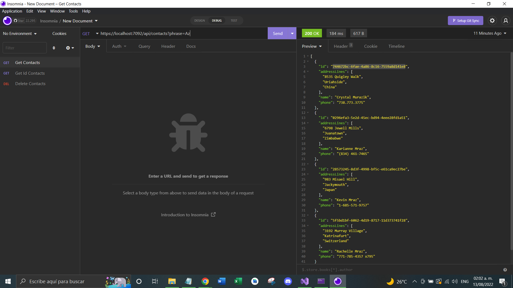
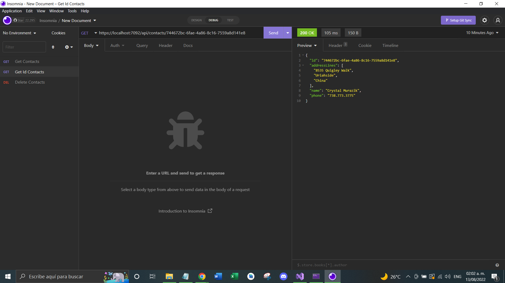
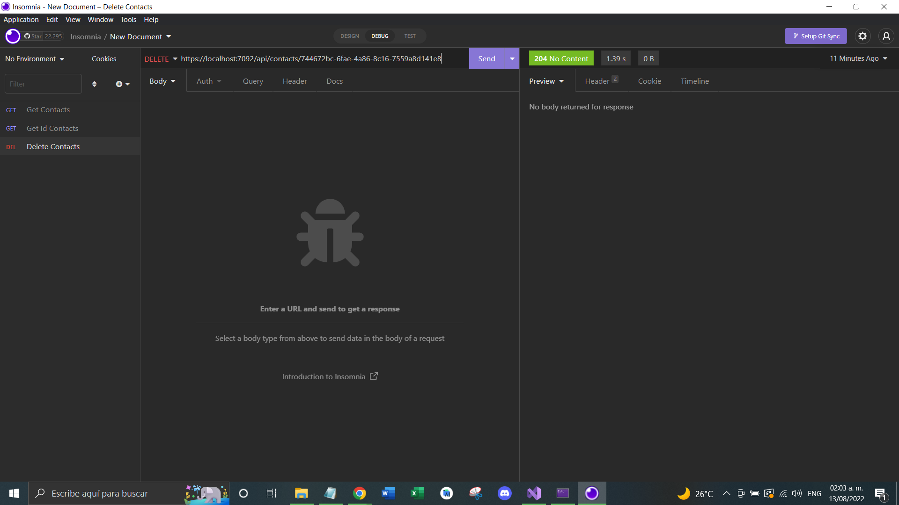

# Programming Test Macropay

### Para ejecutar de forma correcta el programa, primero debe cambiarse el *_connectionString* con la ubicacion de *fakedatabase.js* de su maquina (dado que la variable esta con la ruta de mi equipo).

### Luego ejecutar las peticiones http.

## GET /contacts

https://localhost:7092/api/contacts?phrase=Az

<picture>
  
</picture>

## GET /contacts/

https://localhost:7092/api/contacts/70cb59f1-1598-4a49-9bd9-c9a7530dbb51

<picture>
  
</picture>

## DELETE /contacts/

https://localhost:7092/api/contacts/ab35769c-0e74-42b2-ae31-7b5f3a22ef81

<picture>
  
</picture>
